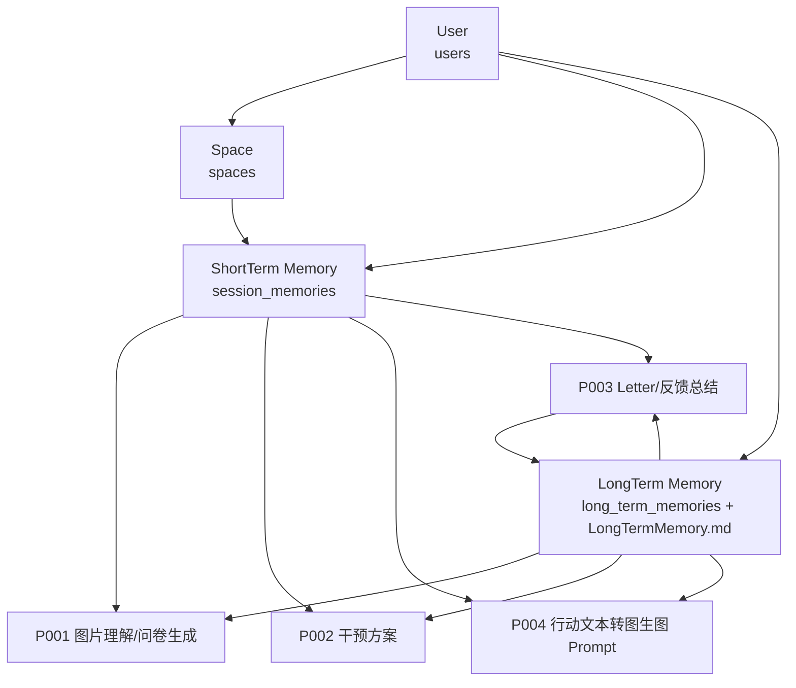

# NestAI 用户、画像与记忆系统

## 最小真实模型

NestAI 现在采用一个轻登录模型：用户输入昵称和可选邮箱，后端创建或复用一个 `User`。这个用户是所有空间、短期记忆、长期记忆和后续 Prompt 调用的归属锚点。

暂时不接 OAuth、不引入额外云服务。开发阶段使用本地 SQLite 和文件型 LongTermMemory；上线时可以把同一套表迁到 Supabase/Postgres。

## 数据关系

## 记忆分工

短期记忆是一次 Nest 会话的工作台，存放上传图片、P001 空间理解、问卷答案、P002 干预方案、P004 生图结果、用户反馈和 P003 Letter。

长期记忆是用户画像的稳定层，存放生活方式倾向、空间偏好、干预历史和反馈沉淀。它同时存在数据库字段和 `backend/app/memory/users/<userId>/LongTermMemory.md`，Me 页面可以查看。

Prompt 注入时不把完整长期记忆一股脑塞进去，而是通过 `get_compact_long_term_memory(userId)` 压缩成核心画像、偏好和最近干预历史，再交给 P001/P002/P004/P003。

## 产品流程

1. 用户登录：`POST /api/users/login` 创建/复用用户，并确保 LongTermMemory 存在。
2. 上传空间：前端创建 `Space` 和 `SessionMemory` 时传入 `userId`。
3. P001 图片理解：读取本次图片和该用户的压缩长期记忆，输出空间摘要和问卷，写回短期记忆。
4. P002 干预方案：读取 P001、问卷答案、短期记忆和压缩长期记忆，输出固定方案 Schema，写回短期记忆。
5. P004 效果图：读取所选 tier 的行动文本、原图、短期记忆和压缩长期记忆，生成图生图 Prompt，再调用图像模型，结果写回短期记忆。
6. P003 Letter：读取用户反馈和会话上下文生成 Letter，同时把稳定的新偏好、行动历史写入长期记忆。
7. Me 页面：按当前用户读取 sessions、letters 和 LongTermMemory。

## 当前实现位置

- 用户表与记忆模型：`backend/app/services/memory_service.py`
- 用户 API：`backend/app/api/users.py`
- 长期记忆 API：`backend/app/api/memory.py`
- 会话与 Prompt 工作流 API：`backend/app/api/sessions.py`
- 工作流编排：`backend/app/services/workflow_service.py`
- 前端用户态：`frontend/src/stores/user-store.ts`
- 登录页：`frontend/src/pages/login/LoginPage.tsx`
- 前端 API 封装：`frontend/src/lib/api.ts`

## 下一步

最小系统已经可以支撑单机真实使用。下一步可以做三件事：

1. 把 LongTermMemory 的“写入”从简单追加升级为 LLM 总结压缩，避免长期文件无限变长。
2. 给 Me 页面增加“导出/清空我的记忆”。
3. 上线时把 SQLite 换成 Supabase Postgres，并把上传图片迁到 Supabase Storage。
